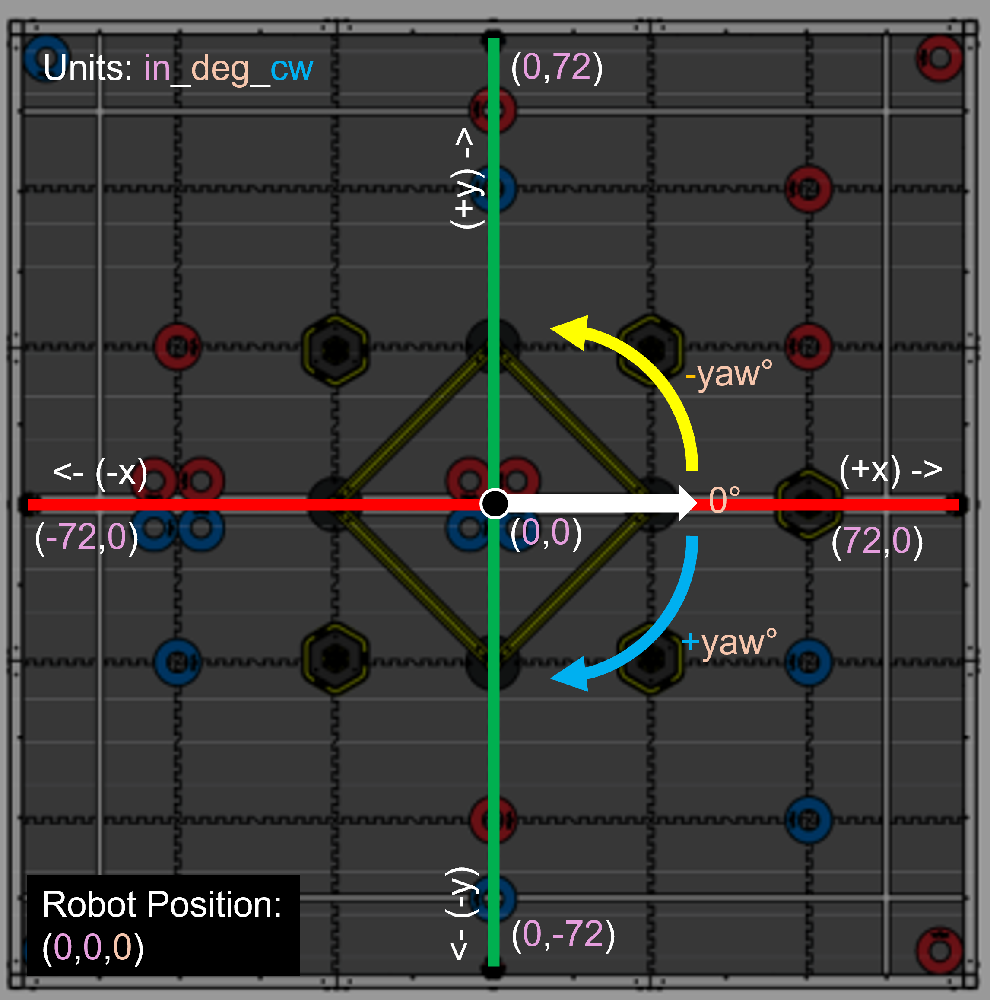
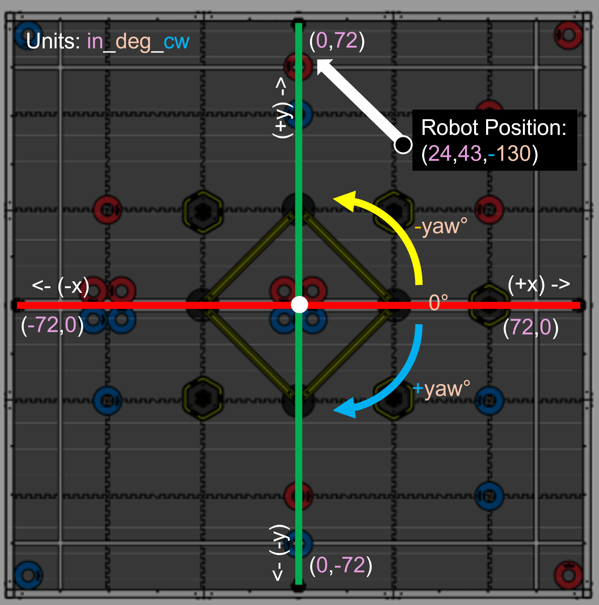

# Drivetrain Commands

WhoopLib is a library heavily specialized in autonomous functionality. Therefore there are a plethora of autonomous commands available. For this documentation, we will be using the pose units Inches, Degrees, Clockwise-Positive (```in_deg_cw```).

A more explicitly detailed illustration of ```in_deg_cw``` would be the following:



The dot with the arrow represents the position of the robot at ```0, 0``` and the arrow indicating the robot facing a yaw of ```0```.

If we move the robot to ```(24, 43)``` with a yaw of ```-130```, the position of the robot will be as follows:



Hopefully this creates a good understanding and pretense as to how the robot operates whenever given a command.

## Turning Functions


## Additional Functions

#### wait_until_completed

If the robot is given a movement command, and you want to do an action after a move completes, there is a wait_until_completed command:

```
/**
* Waits until a drivetrain action during auton is complete.
*/
void wait_until_completed();
```

Example:

```cpp
robot_drivetrain.set_pose_units(PoseUnits::in_deg_cw);
robot_drivetrain.set_pose(0,0,0); // Set the robot's starting position

robot_drivetrain.reverse_through_path({{15, 15, 0}, {0, 0, 90}}, 3.5, waitUntilCompleted::no_wait);
// Your code here to run while the robot is turning
robot_drivetrain.wait_until_completed(); // Wait until the last command is complete before continuing

robot_drivetrain.reverse_to_point(-12, 5, 3.5);
```

#### set_state

Sets the state of the robot (usually to be handled upon startup)

```
/**
* Sets the operational state of the drivetrain.
* @param state The new state to set (disabled, autonomous, or user control).
*/
void set_state(drivetrainState state);
```

| ```drivetrainState```     | Definition | 
|----------|:--------:|
| ```mode_disabled```    | Prohibits the drivetrain from moving at all     |
| ```mode_autonomous```    | Allows autonomous functions, and prohibits controller control for the drivetrain     |
| ```mode_usercontrol```    | Allows controller control for the drivetrain, and prohibits autonomous functions  |

Example:

```cpp
void pre_auton(void)
{
    // Initializing Robot Configuration. DO NOT REMOVE!
    vexcodeInit();
    manager.start();
    robot_drivetrain.set_state(drivetrainState::mode_disabled);
}

void autonomous(void)
{
    robot_drivetrain.set_state(drivetrainState::mode_autonomous);
    // autonomous stuff here
}

void usercontrol(void)
{
    robot_drivetrain.set_state(drivetrainState::mode_usercontrol);

    // User control code here, inside the loop
    while (1)
    {
        wait(10, msec);
    }
}
```

#### calibrate

Calibrates the IMU, tares all rotation sensors used in the drivetrain, and tares the IMU.

```
/**
* Calibrates the robot drivetrain
*/
void calibrate();
```

Example:


```cpp
void pre_auton(void) {
    // Initializing Robot Configuration. DO NOT REMOVE!
    vexcodeInit();
    manager.start();
    robot_drivetrain.set_state(drivetrainState::mode_disabled);
    jetson_commander.initialize(); // If you don't have Tesseract, omit this line
    robot_drivetrain.calibrate();
}
```

#### set_pose_units

```
/**
* Sets the pose units for the system. This can be changed at any point in time, even mid-autonomous
*/
void set_pose_units(PoseUnits units);
```

| ```PoseUnits```     | Definition | 
|----------|:--------:|
| ```in_deg_cw```    | Inches, Degrees, Clockwise-Positive     |
| ```in_deg_ccw```    | Inches, Degrees, Counter-Clockwise-Positive     |
| ```in_rad_cw```    | Inches, Radians, Clockwise-Positive     |
| ```in_rad_ccw```    | Inches, Radians, Counter-Clockwise-Positive     |
| ```m_deg_cw```    | Meters, Degrees, Clockwise-Positive     |
| ```m_deg_ccw```    | Meters, Degrees, Counter-Clockwise-Positive     |
| ```m_rad_cw```    | Meters, Radians, Clockwise-Positive     |
| ```m_rad_ccw```    | Meters, Radians, Counter-Clockwise-Positive     |

Example:

```cpp
void autonomous(void)
{
    robot_drivetrain.set_state(drivetrainState::mode_autonomous);

    robot_drivetrain.set_pose_units(PoseUnits::in_deg_cw);
    robot_drivetrain.set_pose(0,0,0);

    //robot_drivetrain.turn_to_position(15, 15);
    robot_drivetrain.drive_forward(15);
}
```

#### get_pose

```
/**
* Gets the x, y, z, pitch, yaw, roll of the robot
* @return Pose object. With Pose.x, Pose.y, etc...
*/
Pose get_pose();
```

Example:

```cpp
void usercontrol(void)
{
  robot_drivetrain.set_state(drivetrainState::mode_usercontrol);

  // User control code here, inside the loop
  while (1)
  {
    // Drivetrain Odometry
    Pose current_pose = robot_drivetrain.get_pose();
    Brain.Screen.clearLine(4);
    Brain.Screen.setCursor(4, 1);
    Brain.Screen.print("FO (%s): %.1f %.1f %.1f %.1f %.1f %.1f", robot_drivetrain.get_units_str().c_str(), current_pose.x, current_pose.y, current_pose.z, current_pose.pitch, current_pose.yaw, current_pose.roll);

    wait(100, msec);
  }
}

```

#### set_pose

```
/**
* Sets the pose of the robot
* @param x_in the location, in inches, parallel to the width of the driver station
* @param y_in the location, in inches, perpendicular to the width of the driver station
* @param yaw_deg the rotation, clockwise-positive, in degrees
*/
void set_pose(double x_in, double y_in, double yaw_deg);
```

Example (setting pose to 15, 5 at yaw 45 degrees):

```cpp
void autonomous(void)
{
    robot_drivetrain.set_state(drivetrainState::mode_autonomous);

    robot_drivetrain.set_pose_units(PoseUnits::in_deg_cw);
    robot_drivetrain.set_pose(15,5,45);
}
```


Checkout [Jetson Commands](JetsonCommands/README.md).