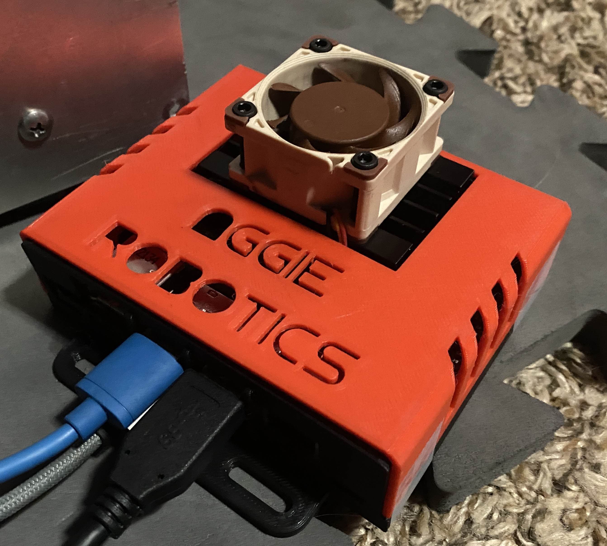
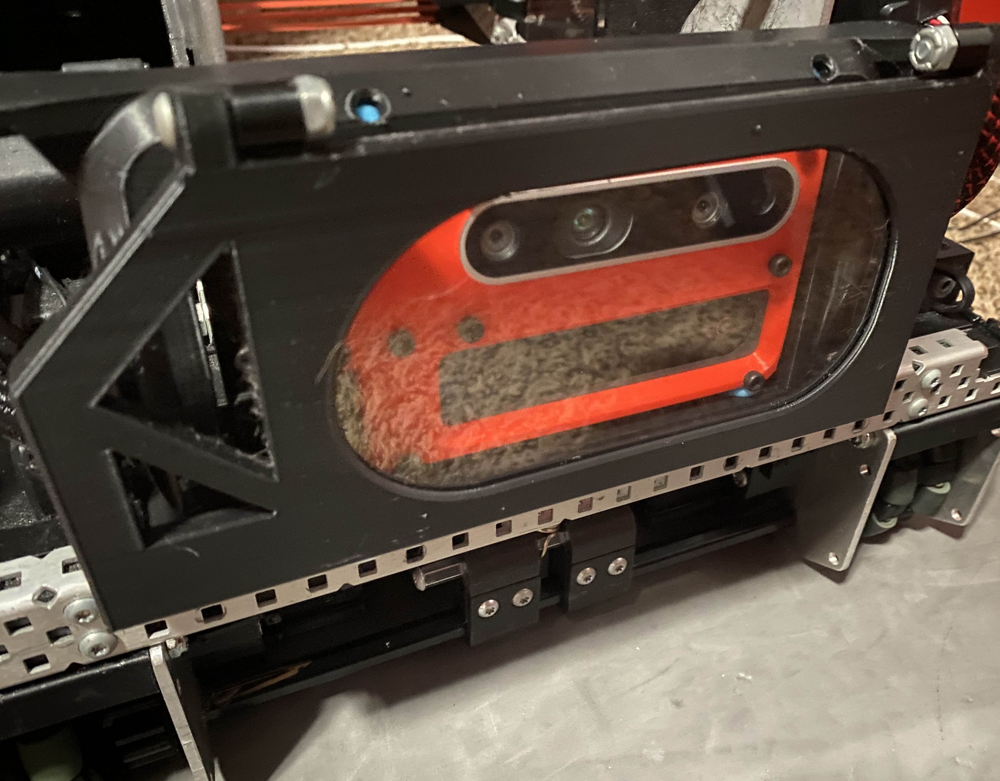

## Hardware For WhoopLib Vision

</img>

## Hardware Order Sheet

Here is the hardware required for the WhoopLib Vision System: [Hardware](https://docs.google.com/document/d/18PjxbSG3SLBllnUnM-vADUMu-K1MK63aHSDAzNHEU74/edit?usp=sharing)

## 3D Printable Components

</img>

You can download and STL files, or Modify the f3z in Fusion 360 Here: [Files Link](https://drive.google.com/drive/folders/1pIy2cVaYX3QHmOdXU2QQLdknpQxjxq2o?usp=sharing)